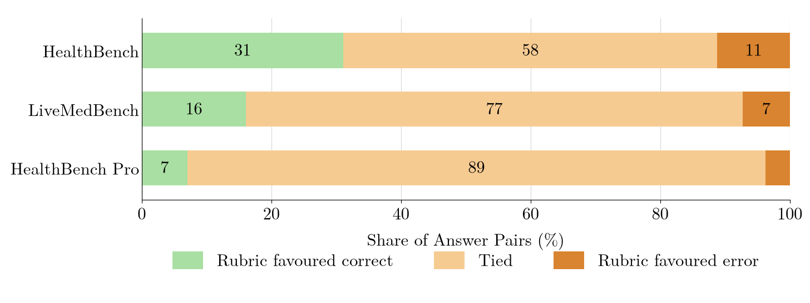
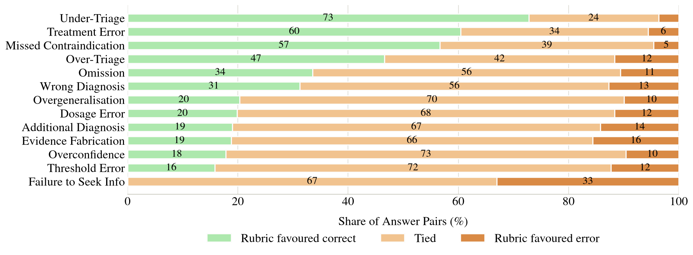

<!--
============================================================================
PAGE CONTENT — edit this file to change the page's prose or figures.

This is the file to edit for day-to-day wording changes. No build step,
no compiling by hand: edit this file, save, refresh the browser (served
over http(s), not file://; see README.md "How to preview locally"). The
actual "compiler" is static/js/content.js, which fetches this file and
converts it to HTML in the browser at page load.

This file is plain, standard Markdown throughout — headings, **bold**,
*italic*, numbered lists, and  images all mean exactly what
they mean in any Markdown file. The only non-prose bit is an invisible
HTML comment before each block (see the real ones starting at "slot:"
below), telling content.js which element on the page that block belongs
to. HTML comments are ordinary, valid Markdown — any renderer (including
GitHub's own preview) just hides them, so this file reads as normal
prose, not a custom format. Don't rename a slot's name unless you also
update the matching `data-md="name"` / `data-md-img="name"` attribute in
index.html. Don't delete a slot comment; if you want a section empty,
leave a single space after it.

(A note for editing this header itself: don't write out a literal
"slot:"-comment as an example the way this sentence just did in words --
content.js's parser can't tell an example inside this description apart
from a real one, so a literal example here would be read as an actual,
oddly-named block.)

A heading's level (#, ##, ###) doesn't matter for slots that land in an
existing <h1>/<h2>/<h3> on the page — the target element already sets the
real heading level, so content.js just strips the "#"s and keeps the
text. Feel free to still write "##" etc. for readability; it's optional.

An image slot (one ending in "-image", e.g. "problem-image") can add an
optional second line, "position: left" / "right" / "center", to choose
where that figure sits — "center" (the default, today's layout for every
figure) keeps it centred; "left"/"right" floats it with body text
wrapping alongside.

An image slot can also add an optional "dark: static/images/whatever.png"
line — a second image shown instead of the first only when the dark theme
is active (e.g. the same diagram exported twice, with light and dark
line-art). Only works where index.html has wired up a matching dark 
for that slot (today: problem-image, method-image) — see
static/js/content.js.

ORDER: the page follows this file. There is a second kind of marker,
written like a slot marker but saying "section:" instead, before each
top-level section. Move one of those markers — together with everything
under it, up to the next "section:" marker — to a new place in this file,
save, refresh, and that part of the page moves too. The hero
(title/authors/links) always stays first and the footer always stays
last; everything between them is ordered by this file. Each "section:"
name matches a `data-section-group="name"` in index.html, and one name
can cover several <section> tags (Overview covers three, which is why its
TL;DR, figure and Key Takeaways always travel together).

Each takeaway-N (in Key Takeaways) is a link to the matching finding-N-title
(in Results) -- index.html wraps it in <a href="#finding-N-title">-- so it
should use the same name as that finding: copy its text here, minus the
leading "N. " (a literal "1. " etc. at the very start of a block is read as
an ordered-list marker by content.js, not plain text).

Every heading and paragraph must sit under its own marker; "slot:" and
"section:" comments are the only ones content.js recognises. Loose text
between two markers becomes part of whichever block it falls inside -- a
stray "### Something" line, for instance, renders as the literal text
"### Something" in the previous block rather than as a heading. Likewise,
a numbered list only renders as a real list if EVERY line in its block is
a "1. "-style item; one extra paragraph in the same block turns the whole
thing back into plain paragraphs.

Structured/tabular or logic-tied content does NOT live here:
  - Author names, links, affiliation, correspondence -> authors.yaml
  - arXiv / Code / Dataset links                      -> links.yaml
  - BibTeX citation                                   -> citation.bib
  - Taxonomy table rows (13 error types)               -> taxonomy.md
  - Title, fonts, colours, sizes                       -> static/js/theme.js
    (the <h1> paper title and nav wordmark are rendered from THEME.title,
    but are also duplicated in <title>/OpenGraph/Highwire meta tags and
    citation.bib, which must remain static — update those by hand too.)
============================================================================
-->

<!-- section: overview -->

<!-- slot: tldr -->
**TL;DR.** Rubric-based evaluation can miss clinically meaningful hallucinations. Across established medical LLM benchmarks, we find that many controlled errors leave rubric scores unchanged, revealing systematic blind spots when the relevant facts are not explicitly anticipated by the rubric. We expose these blind spots using a clinically validated hallucination taxonomy and error-injection pipeline, and find that retrieval-grounded checks can recover some errors that rubrics miss.

<!-- slot: problem-title -->
## A clinical error can leave the rubric score unchanged.

<!-- slot: problem-caption -->
A safe insulin dose is contrasted with a hundredfold overdose hallucination. Both responses are scored by the same rubric and the same LLM grader. They receive indistinguishable scores. The difference between them is clinically critical. This is the blind spot this paper investigates.

<!-- slot: problem-image -->

dark: static/images/figure-1-blind-spot-dark.gif

<!-- slot: takeaways-title -->
## Key Takeaways

<!-- slot: takeaway-1 -->
**Rubrics miss clinically meaningful hallucinations.** Across HealthBench, HealthBench Professional, and LiveMedBench, many clinical hallucinations leave rubric scores unchanged, meaning these errors are often not reflected in benchmark performance.

<!-- slot: takeaway-2 -->
**Blind spots depend on what the rubric anticipates.** Rubrics are most effective when they explicitly specify the facts needed to identify an error, but struggle with unexpected or additive errors that cannot be anticipated and encoded in advance.

<!-- slot: takeaway-3 -->
**High-stakes domains must evaluate beyond rubrics.** Retrieval-grounded checks can catch some rubric-blind errors, motivating more dynamic evaluators that verify claims using external evidence or specialised checkers.

<!-- section: method -->

<!-- slot: method-title -->
## Methodology

<!-- slot: method-intro -->

For each benchmark question, we generate one original model answer and create a matched version with a single, controlled clinical error injected. The two responses are otherwise kept as similar as possible, allowing us to isolate whether the injected error changes the benchmark score.

<!-- slot: taxonomy-title -->
### Taxonomy

<!-- slot: taxonomy-intro -->

We develop a taxonomy of clinically relevant hallucination error types grounded in the medical-LLM literature and validated by a clinical panel. Each error type represents a single controlled perturbation rather than a naturally occurring hallucination, allowing us to test whether specific clinical failures are reflected in rubric scores.

<!-- slot: method-pipeline-title -->
### Pipeline

<!-- slot: method-image -->

dark: static/images/figure-3-pipeline-dark.png

<!-- slot: method-figcaption -->

The error-injection pipeline: applicability check, error generation, quality checks with a reject-and-retry loop, followed by clinician review on a subset.

<!-- slot: method-pipeline-body -->

Two models independently determine whether an error type applies to the original response, and an error is introduced only when both agree. An error-generation model then modifies the response to introduce the selected error while preserving the rest of the answer. The resulting response passes a programmatic check and an LLM quality check, with failed generations rejected and retried. Accepted responses are scored against the benchmark's own rubric and grader in the same way as the original, with a subset undergoing clinician review. 

<!-- slot: method-validation-title -->

### Clinical Review

<!-- slot: method-closing -->

A stratified subset of answer-error pairs is independently reviewed by clinicians to confirm that the injected errors are clinically meaningful. **80.3% of reviewed pairs were judged to change diagnosis or management**, supporting the clinical significance of the injected errors. 

<!-- section: results -->

<!-- slot: results-title -->
## Results

<!-- slot: finding-1-title -->
### Rubrics miss clinically meaningful hallucinations.

<!-- slot: finding-1-caption -->
Share of matched pairs where the rubric favoured the correct answer, tied, or favoured the error-injected answer, across three benchmarks.

<!-- slot: finding-1-image -->

<!-- slot: finding-1-body -->
We inject a single controlled clinical error into otherwise-correct model answers and re-score both responses using each benchmark’s own rubric. Tied scores are the most common outcome across HealthBench, LiveMedBench, and HealthBench Professional, showing that many clinically meaningful errors do not affect rubric scores. When rubrics do distinguish the pair, they can also favour the error-injected answer, with overall discrimination remaining weak and reaching no better than chance on HealthBench Professional.

<!-- slot: finding-2-title -->
### Blind spots depend on what the rubric anticipates.

<!-- slot: finding-2-caption -->
HealthBench: share of pairs favouring the correct answer, tied, or favouring the error, by error type.

<!-- slot: finding-2-image -->

<!-- slot: finding-2-body -->
Rubrics are most effective when they explicitly specify the relevant fact, while broad criteria provide little signal. Errors that introduce unexpected or additive information are therefore particularly difficult for fixed rubrics to catch.

<!-- slot: finding-3-title -->
### High-stakes domains must evaluate beyond rubrics.

<!-- slot: finding-3-body -->
We find that **retrieval-grounded checks can recover clinically meaningful errors missed by rubrics**. In HealthBench pairs where rubric scores were tied, our retrieval evaluator identified the injected error as a checkable claim in **88.7% of cases** and flagged most of these as unsupported. However, our **preliminary retrieval-based approach also produced substantial false positives**, flagging 55.3% of original, correct responses as unsupported. This suggests retrieval-grounded checks are a promising complement to rubric evaluation and clinical review, but require further validation.

<!-- section: beyond -->

<!-- slot: implications-title -->
## Going Beyond Rubrics

<!-- slot: implications-list -->

**Make rubrics more factual and specific.** More specific rubrics improve discrimination and reduce dependence on grader capability, but even highly specific rubrics do not catch every clinically meaningful error. Rubrics should therefore anchor evaluation to the concrete facts that matter for each question.

**Add checks that can go beyond predefined criteria.** Claims that a rubric does not anticipate can be checked against external evidence or specialised factuality tools. Our retrieval experiment provides preliminary evidence that this can recover errors missed by rubric evaluation.

**Combine complementary evaluation methods.** A robust evaluator should combine rubric scoring with claim-level evidence verification, specialised checks, and clinical review rather than relying on a single evaluation signal. The goal is to retain the strengths of rubrics while extending evaluation to errors they cannot anticipate.

<!-- section: cite -->

<!-- slot: cite-title -->
## Citation (BibTeX)

<!-- slot: bibtex-note -->
 

<!-- slot: footer-note -->

